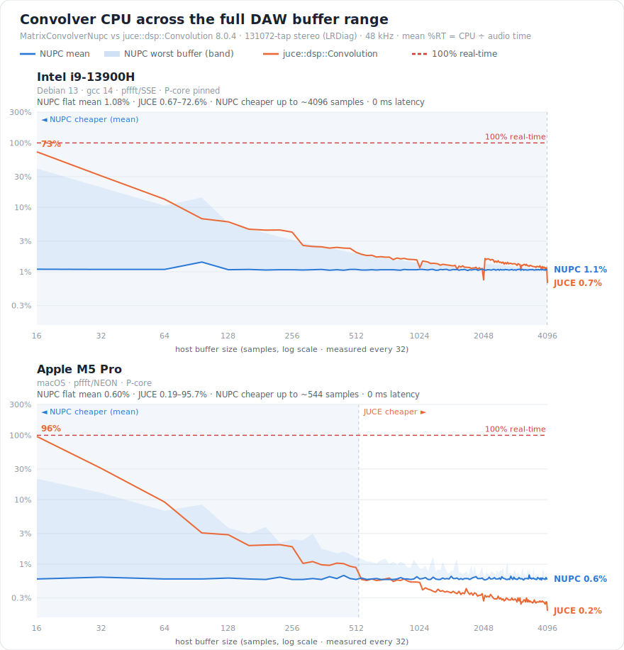

<!-- SPDX-License-Identifier: AGPL-3.0-or-later -->

# Convolver benchmark — MatrixConvolverNupc vs juce::dsp::Convolution

The `lineareq` EQ convolves on **`MatrixConvolverNupc`** — a JUCE-free, non-uniform (Gardner 1995) partitioned
convolver: a 128-sample time-domain head + geometrically growing overlap-save FFT tail stages, on the SIMD
`pffft` backend. It is **block-INDEPENDENT** (one `prepare()`, the same cost at every host block), **true
sample-zero-latency**, and a NULL-verified drop-in for the old fixed-`P=128` `MatrixConvolver`.



## Head-to-head (131072-tap stereo IR, LRDiag, 48 kHz, Apple M5 Pro, pffft · JUCE 8.0.4)

All three report `getLatency() == 0`. `%RT = CPU / audio time`; lower is better.

| host block | `juce::dsp::Convolution` | `MatrixConvolver<pffft>` (old) | **`MatrixConvolverNupc<pffft>`** | ratio |
|---:|---:|---:|---:|---|
| 64   | 10.50% | 2.17% | **0.62%** | **17× vs JUCE · 3.5× vs old** |
| 128  | 3.40%  | 2.23% | **0.62%** | 5.5× vs JUCE · 3.6× vs old |
| 256  | 2.00%  | 2.30% | **0.67%** | 3.0× vs JUCE · 3.4× vs old |
| 512  | 0.98%  | 2.21% | **0.64%** | 1.5× vs JUCE · 3.5× vs old |
| 1024 | 0.50%  | 2.19% | **0.62%** | JUCE 1.2× · 3.5× vs old |
| 2048 | 0.29%  | 2.24% | **0.63%** | JUCE 2.2× · 3.6× vs old |
| 4096 | 0.19%  | 2.29% | **0.65%** | JUCE 3.4× · 3.5× vs old |
| 8192 | 0.15%  | 2.22% | **0.64%** | JUCE 4.3× · 3.5× vs old |

**The result.** `MatrixConvolverNupc` is a flat **~0.62 % RT at every host block** — **≈3.5× cheaper than the old
fixed-`P=128` matrix convolver everywhere**, and **3–17× cheaper than JUCE at the 64–128-sample buffers a guitar
amp or live monitor actually runs**. JUCE's cost swings ~70× with the block (10.50 % → 0.15 %): it is expensive
at the small blocks and only overtakes us past ~512 samples, where its few large partitions cost less.

## The full buffer range — the nose-to-nose sweep (4 → 8192, log-ladder, two machines)

The head-to-head above walks powers of two. This sweep samples the whole range on a **geometric (log-uniform)
ladder** — ~4 points per octave, dense where it matters (small buffers) — on **two very different CPUs**: an Apple M5
Pro (NEON) and an Intel i9-13900H (SSE, pinned to a P-core). LRDiag, JUCE 8.0.4 oracle-tuned (`maxBlock` = the actual
buffer). Each point is the **mean of 3–10 warmed measure windows** (escalated when the spread is large); the NUPC
spread stayed **< ~6 %**. NUPC is measured from 4; JUCE only from 16 (below 16 is not a real host buffer and just
distorts the plot). NUPC is **flat everywhere**; JUCE is a sawtooth that peaks at each power of two. The chart at the
top of this page carries both machines and all 43 points; representative rows (`mean(worst)` = NUPC mean and
worst-single-buffer %RT):

| host buffer | M5 Pro · JUCE | M5 · NUPC mean(worst) | i9-13900H · JUCE | i9 · NUPC mean(worst) |
|---:|---:|---:|---:|---:|
| 4    | — (synthetic) | 0.69 (152.6) | — (synthetic) | 1.11 (158.6) |
| 16   | 107.7 % | 0.61 (31.1) | 71.5 % | 1.08 (38.6) |
| 64   | 9.72 %  | 0.59 (12.6) | 12.8 % | 1.08 (10.5) |
| 128  | 2.94 %  | 0.62 (5.5)  | 5.84 % | 1.09 (5.6)  |
| 256  | 1.94 %  | 0.61 (1.8)  | 4.12 % | 1.08 (3.0)  |
| 512  | 0.98 %  | 0.62 (1.3)  | 2.00 % | 1.08 (1.9)  |
| 1024 | 0.48 %  | 0.63 (1.1)  | 1.16 % | 1.09 (1.4)  |
| 2048 | 0.29 %  | 0.63 (0.7)  | 0.75 % | 1.07 (1.1)  |
| 4096 | 0.18 %  | 0.59 (0.7)  | 0.67 % | 1.09 (1.1)  |
| 8192 | 0.15 %  | 0.64 (0.7)  | 0.54 % | 1.08 (1.1)  |

**Reading it.** NUPC's mean is flat — **~0.6 % on the M5, ~1.08 % on the i9** — at every buffer from one `prepare()`;
the ~1.8× gap between machines is core speed (Apple/NEON vs Intel/SSE), not the algorithm. JUCE's cost tracks the
buffer: dear at the small, low-latency sizes (up to ~108 % / ~72 % at 16 samples — over real-time on the M5), cheap at
large blocks. The lines cross around **~640 samples on the M5**; on the **i9 NUPC is cheaper almost everywhere**, JUCE
only winning the mean near 4096–8192. Both are zero-latency throughout. The worst-buffer column is the
once-per-`B_max` coincident-FFT spike — bounded and rare, decaying to ~1 % by block 256. Below 16 samples (not a real
host buffer, shown only to characterise) that single worst buffer can exceed real-time, while the **mean stays flat
~0.6 %**.

> **Measurement notes.** (1) Each point is the mean of 3–10 warmed windows (adaptive on the spread) — external jitter
> only *adds* time, so a tight spread means the mean equals the true cost, and the median tracked the mean. (2) On a
> hybrid CPU (the 13900H) pin the bench to a performance core — an E-core reads ~2× slower. (3) JUCE's tiny-block cost
> still carries a few-% run-to-run variance (e.g. M5 @16 measured 96–108 % across runs). (4) The `B_max=2048` cap
> bounds the worst-buffer spike (a smaller cap trims it; time-distributed scheduling is the planned RT hardening).

## Per topology (all flat, block-independent)

`MatrixConvolverNupc<pffft>`, mean %RT (worst single-buffer %RT in parentheses):

| host block | LRDiag | MSDiag | Full |
|---:|---:|---:|---:|
| 64   | 0.63% (24.8%) | 0.76% (8.8%) | 0.81% (11.8%) |
| 256  | 0.61% (1.7%)  | 0.75% (3.0%) | 0.81% (2.9%)  |
| 1024 | 0.62% (0.8%)  | 0.74% (1.1%) | 0.82% (1.2%)  |
| 8192 | 0.62% (0.6%)  | 0.75% (0.8%) | 0.83% (0.9%)  |

MSDiag / Full add the ½(X_L±X_R) view / the 4-bank cross sums — a modest, flat surcharge over LRDiag.

## Honest bounds

- **JUCE wins the mean at large blocks (≥1024).** That is a theorem, not a shortfall: true *sample*-zero-latency
  forces small partitions in the near field (FFT overhead) that JUCE never pays. The win is small-blocks +
  block-independence; both are zero-latency. Chasing JUCE at 8192 would mean *becoming* JUCE (block-granular,
  `P=maxBlock`) — surrendering the thing it structurally cannot do.
- **The worst-buffer spike.** Every stage's FFT coincides once per `lcm = B_max` samples; at tiny blocks that one
  buffer is expensive (LRDiag ~25 % of a single 64-sample buffer, dropping to ~1 % by block 512). The *mean* is
  flat ~0.62 %; the spike is bounded and < 100 % (no xrun on its own). Distributing the large FFTs over their
  deadline (time-distributed scheduling) is a later-phase RT-hardening; a smaller `B_max` already trims it.
- **Variable buffers — the real-world edge.** JUCE's cost tracks the *actual* block: prepared for maxBlock=8192
  but fed 256, it stays zero-latency yet pays 2.67 % (worse than its own 256-tuned 2.00 %). NUPC is flat ~0.62 %
  from one prepare — cheaper and steadier for a host that delivers small or variable buffers.

## Reproduce

```sh
cmake -S . -B build-juce -DCMAKE_BUILD_TYPE=Release -DFELITRONICS_WITH_PFFFT=ON -DFELITRONICS_BENCH_JUCE=ON
cmake --build build-juce --target fcore_fftbench -j
./build-juce/tools/fcore_fftbench                       # correctness probe + OLD/NEW/pffft + NUPC + matrix-NUPC + JUCE head-to-head
FCORE_FINE_SWEEP=1 ./build-juce/tools/fcore_fftbench    # the fine log-ladder sweep (4→8192, adaptive 3–10 reps), CSV
FCORE_SWEEP_ONLY=1 ./build-juce/tools/fcore_fftbench    # (legacy) the +32 linear sweep 16→4096
```

Regenerate the chart above (`docs/assets/nupc-vs-juce.svg`) from a per-machine CSV of the fine sweep (on the i9,
pin the bench to a P-core: `taskset -c 0 env FCORE_FINE_SWEEP=1 …`):

```sh
FCORE_FINE_SWEEP=1 ./build-juce/tools/fcore_fftbench | grep -E '^  [0-9]' > i9.csv   # run on each machine
python3 tools/plot-convolver-sweep.py i9.csv m5.csv docs/assets/nupc-vs-juce.svg
```

Correctness: `MatrixConvolverNupc`'s output is NULL-verified sample-by-sample against a direct time-domain
convolution and the proven `PartitionedConvolver`, across all topologies + the click-free swap, on both the
scalar and pffft backends (a randomized differential fuzzer + ASan/UBSan/TSan). See
[`PERF-CONVOLVER-JUCE-GAP.md`](PERF-CONVOLVER-JUCE-GAP.md) for the design (the non-uniform schedule, the
zero-latency invariant, the phased build).
